<p align="center">
  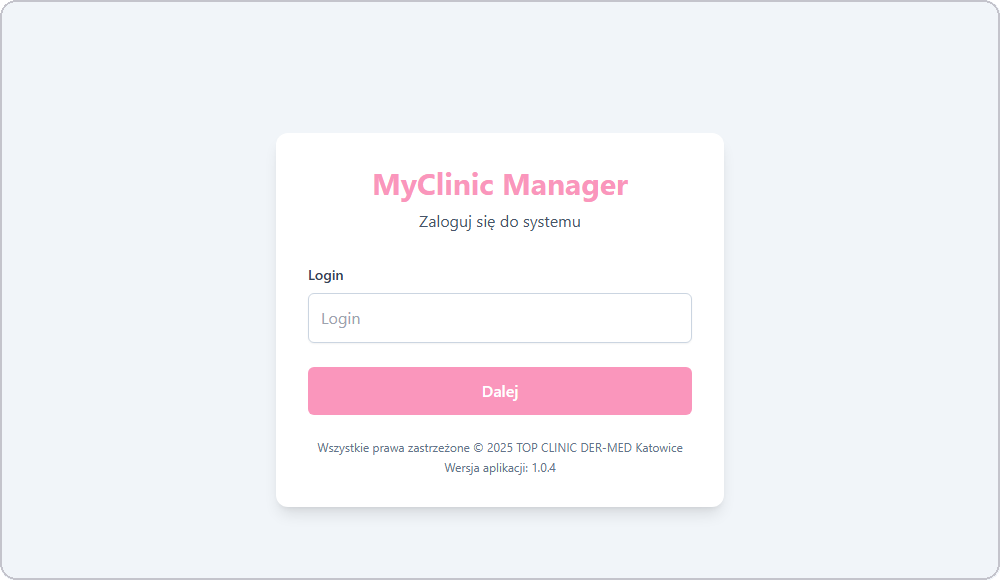
</p>

<h1 align="center">MyClinic Manager</h1>

<h3 align="center">Full-stack clinic management system for aesthetic medicine</h3>

<p align="center">
  <em>Built for real clinic operations - sales tracking, cost analysis, commissions, and analytics.</em>
</p>

<p align="center">
  
  
  
  
  
  
</p>

---

## Table of Contents

- [About](#-about)
- [Screenshots](#-screenshots)
- [Source Code](#-source-code)
- [Tech Stack](#%EF%B8%8F-tech-stack)
- [Features](#-features)
- [Architecture](#-architecture)
- [Statistics](#-statistics)
- [Contact](#-contact)

---

## About

**MyClinic Manager** is a production app I built for **TOP CLINIC DER-MED Katowice**, a real aesthetic medicine clinic. It handles all the day-to-day operations that used to be done on paper or in spreadsheets - recording sales, managing service and material catalogs, tracking doctor commissions, and analyzing profitability.

The system runs as a responsive web app and an Android app (via Capacitor), and it's actively used by clinic staff across three roles: Administrator, Manager, and User.

---

## Screenshots

### Desktop

| Login | Dashboard |
|:---:|:---:|
|  | 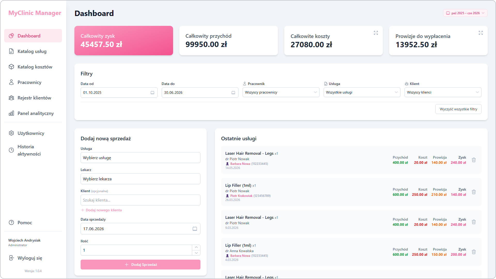 |

| Service catalog | Adding a service |
|:---:|:---:|
| 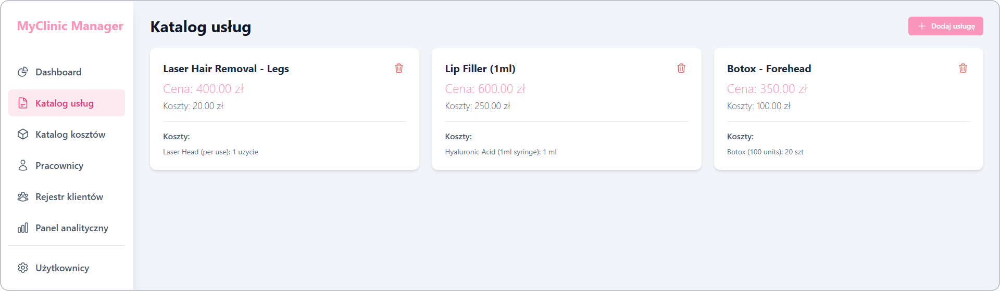 | 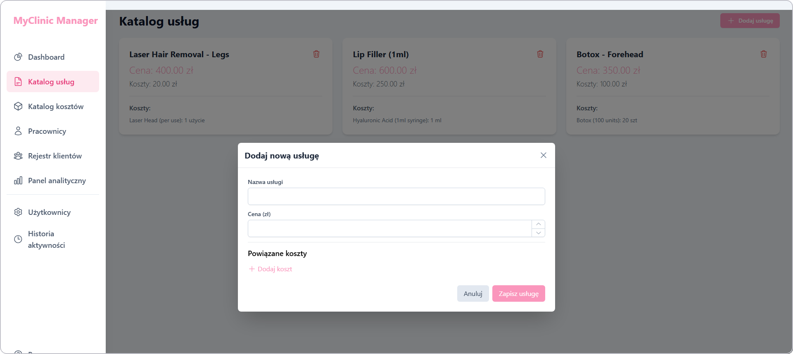 |

| Cost catalog | Adding a cost |
|:---:|:---:|
| 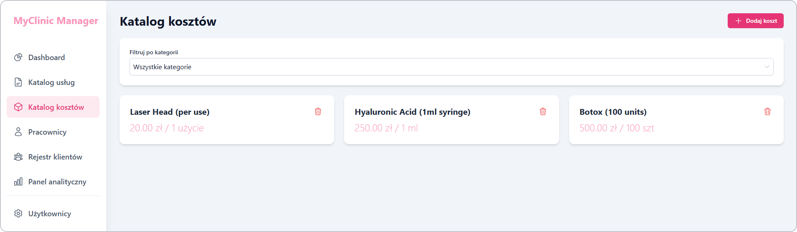 | 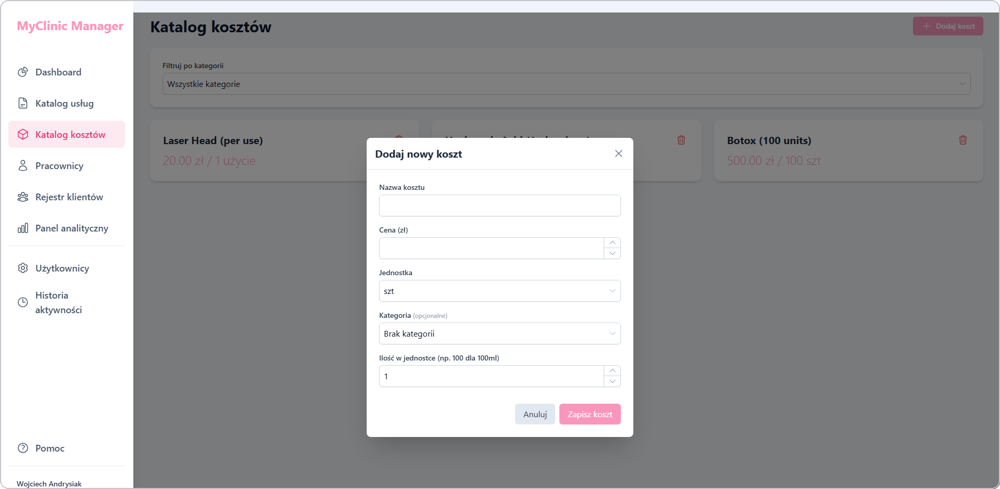 |

| Employees | Adding an employee |
|:---:|:---:|
| 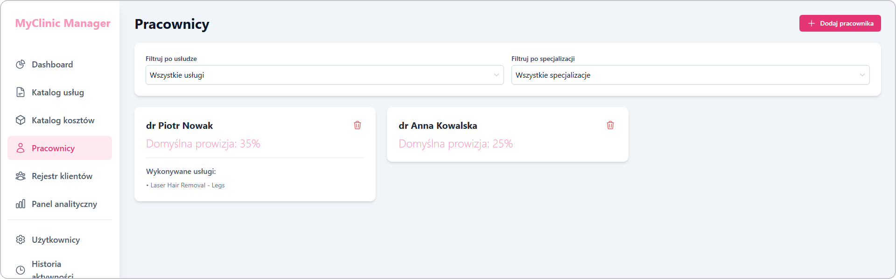 | 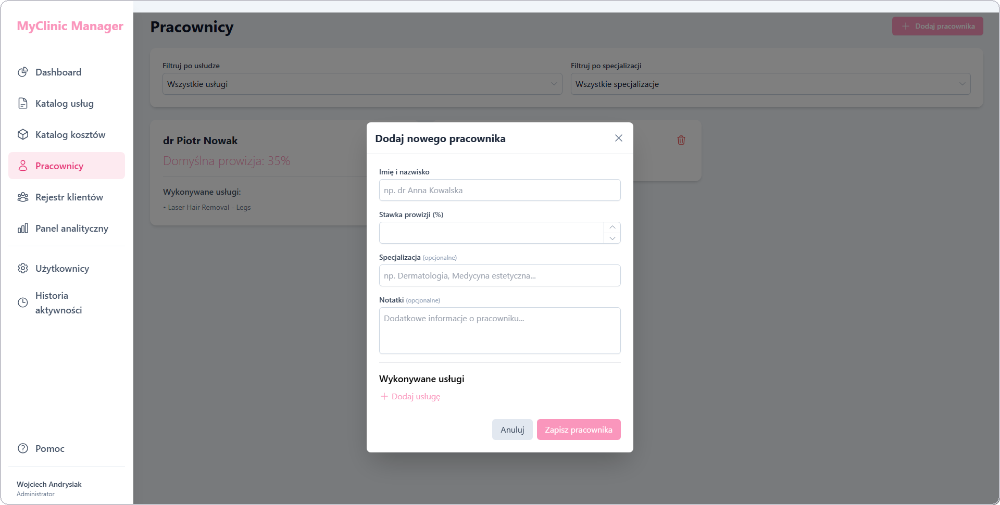 |

| Client registry | Adding a client |
|:---:|:---:|
| 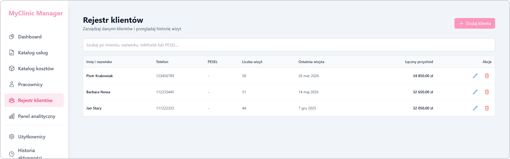 | 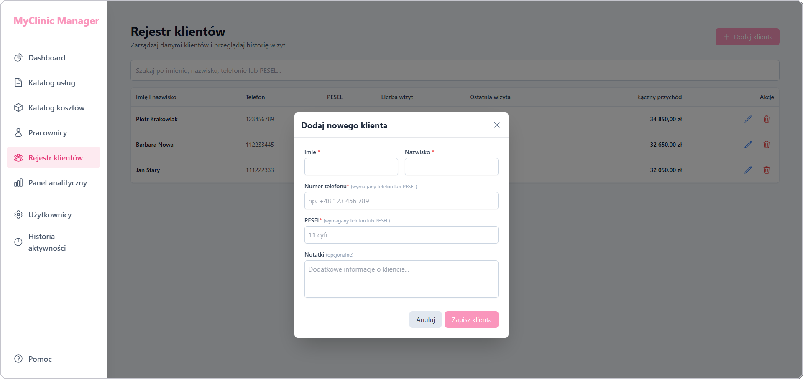 |

| Analytics panel |
|:---:|
| 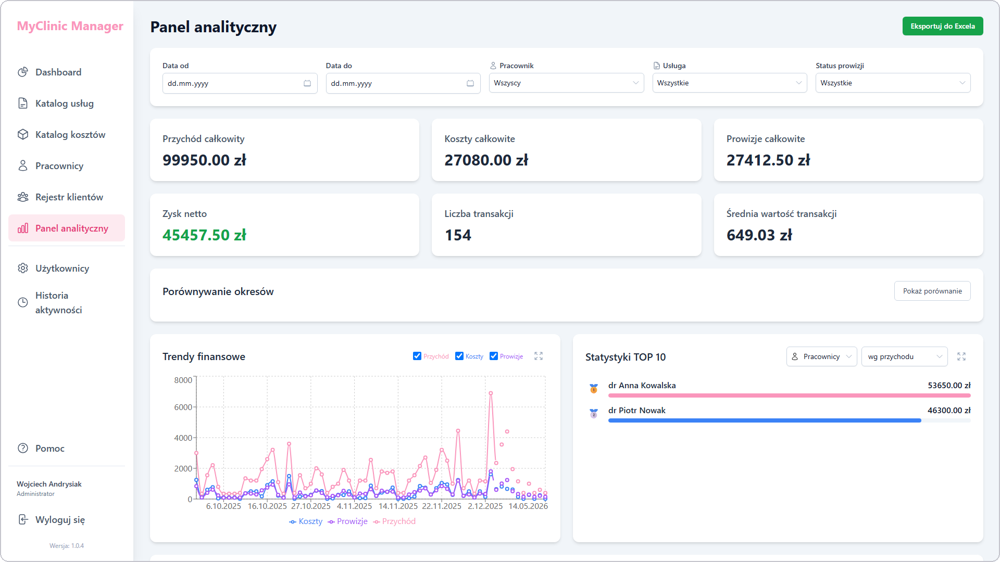 |

### Mobile

| Dashboard | Navigation |
|:---:|:---:|
| 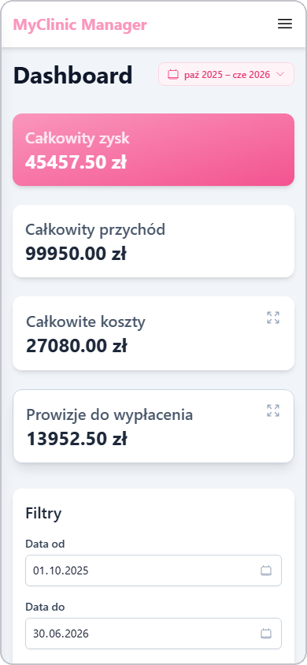 | 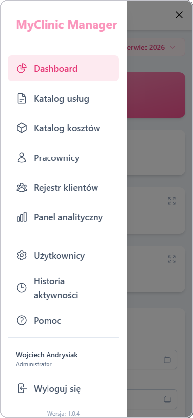 |

> **Note:** All data shown in the screenshots is fictional and created purely for demonstration purposes. Names, financial figures, and other details are made up and do not reflect any real people or actual clinic records.

---

## Source Code

> **The source code is private, but I'm happy to give access to recruiters who'd like to review the implementation.**

**What I can share on request:**

- Full application code (React 19 + TypeScript)
- Supabase schema, RLS policies, and RPC functions
- Capacitor Android configuration
- Architecture docs and feature implementation details

---

## Tech Stack

### Frontend

```
React 19 + TypeScript 5.8   // Type-safe UI with concurrent rendering
Vite 6                      // Sub-second HMR, fast production builds
Tailwind CSS 3.4            // Utility-first responsive styling
Recharts 3.5                // Composable chart components for analytics
```

### Mobile

```
Capacitor 8                 // Single codebase for web + Android (~95% shared)
```

### Backend & Data

```
Supabase (PostgreSQL)       // Managed BaaS with RLS, RPCs, and real-time
Custom RPC + bcrypt auth    // Rate limiting, role checks, forced password setup
ExcelJS 4.4                 // Native Excel export for offline reports
```

### State & Tooling

```
React Context API           // Lightweight global state, no extra dependencies
Hash routing                // SPA navigation compatible with Capacitor WebView
```

---

## Features

### Dashboard
- **KPI cards** - net profit, revenue, costs, commissions at a glance
- **Smart filters** - filter by date range, employee, service, or client
- **Quick sale entry** - add sales with inline client creation
- **Transaction history** - role-based visibility for recent activity

### Catalogs
- **Services** - pricing, linked material costs, profit margin per service
- **Costs** - materials and consumables with unit pricing and categories
- **Employees** - default and per-service commission rates, specializations

### Client Management
- **Client registry** - search by name, phone, or PESEL
- **Visit history** - track visits and lifetime revenue per client

### Analytics (Admin only)
- **Financial trends** - interactive line charts for revenue, costs, and profit
- **Period comparison** - compare performance across time ranges
- **TOP 10 rankings** - employees, services, and clients by revenue
- **Excel export** - download detailed transaction tables

### Security & Administration
- **Role-based access** - Administrator, Manager, and User roles
- **User management** - create accounts, reset passwords
- **Full audit log** - every data change is tracked and timestamped
- **Contextual help** - built-in help system with role-specific guidance

### Mobile
- **Responsive layout** - adapts cleanly from desktop to phone
- **Slide-out navigation** - touch-friendly sidebar
- **Android APK** - same codebase, native feel via Capacitor

---

## Architecture

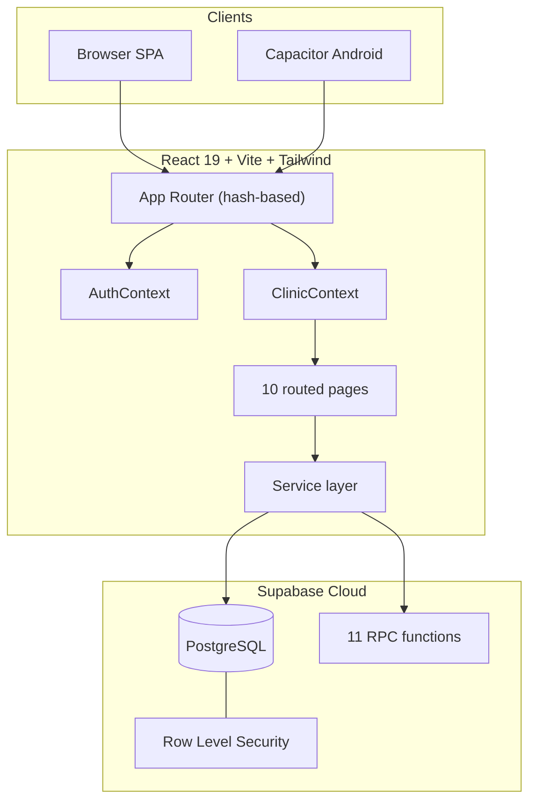

---

## Statistics

### Technical Complexity

| Metric | Count |
|---|---|
| **React components** | ~50+ |
| **Application screens** | 10+ |
| **Database tables** | 9 |
| **Supabase RPC functions** | 11 |
| **Service-layer methods** | ~48 |
| **User roles** | 3 |

### Features Overview

| Category | Highlights |
|---|---|
| **Data entry** | Sales, services, costs, employees, clients |
| **Analytics** | Charts, period comparison, TOP 10, Excel export |
| **Security** | RBAC, audit logs, rate-limited auth |
| **Mobile** | Android APK via Capacitor |

---

## Contact

| Platform | Link |
|---|---|
| **Email** | [w.andrysiak.s3@gmail.com](mailto:w.andrysiak.s3@gmail.com) |
| **GitHub** | [wandrysiak](https://github.com/wandrysiak) |

---

<p align="center">
  <strong>MyClinic Manager</strong> - combining modern web development with real clinic business needs.
  <br/><br/>
  Made by Wojciech Andrysiak
</p>
